# Memoria técnica - MySQL Cliente-Servidor en Ubuntu

## 1. Resumen de la práctica

Esta práctica consiste en instalar y configurar MySQL en un entorno cliente-servidor utilizando dos máquinas Ubuntu 24.04.

El objetivo principal es tener un servidor MySQL centralizado y permitir que una máquina cliente pueda conectarse por red mediante un usuario remoto con permisos sobre una base de datos concreta.

Además de la conexión desde terminal, también se comprueba el funcionamiento con herramientas gráficas como MySQL Workbench y DBeaver.

El repositorio se ha reorganizado para que quede más limpio y profesional:

* `README.md` como presentación corta del proyecto.
* `docs/memoria.md` como documentación completa.
* `capturas/` para las evidencias visuales.
* `.gitignore` para evitar archivos innecesarios.
* `.gitattributes` para controlar los saltos de línea.

---

## 2. Entorno utilizado

Para esta práctica se utilizan dos máquinas Ubuntu 24.04.

```text
Servidor MySQL:
- Sistema operativo: Ubuntu Server 24.04
- IP del laboratorio: 192.168.1.17
- Servicio principal: MySQL Server
- Función: alojar la base de datos y aceptar conexiones remotas

Cliente:
- Sistema operativo: Ubuntu 24.04
- IP del laboratorio: 192.168.1.16
- Herramientas: MySQL Client, MySQL Workbench y DBeaver
- Función: conectarse al servidor MySQL y comprobar el acceso remoto
```

La base de datos utilizada en la práctica se llama:

```text
nba
```

---

## 3. Instalación de MySQL en el servidor

Primero se actualizan los repositorios del sistema en la máquina servidor.

```bash
sudo apt update
```

Después se instala MySQL Server.

```bash
sudo apt install -y mysql-server
```

Una vez finalizada la instalación, se comprueba la versión instalada.

```bash
mysql --version
```

También se comprueba que el servicio de MySQL está activo.

```bash
sudo systemctl status mysql
```

La salida debe indicar que el servicio está en ejecución.

```text
Active: active (running)
```

Con esto ya se confirma que MySQL está instalado y funcionando correctamente en el servidor.

---

## 4. Acceso inicial a MySQL

Para acceder a MySQL desde el propio servidor se puede usar:

```bash
sudo mysql
```

También se puede acceder como usuario `root` si ya existe una contraseña configurada.

```bash
mysql -u root -p
```

En caso de necesitar establecer contraseña para `root`, se puede usar una orden como esta:

```sql
ALTER USER 'root'@'localhost'
IDENTIFIED WITH mysql_native_password BY 'CHANGE_ME_ROOT_PASSWORD';

FLUSH PRIVILEGES;
```

En el repositorio no se publica ninguna contraseña real. Se utilizan valores placeholder como `CHANGE_ME_ROOT_PASSWORD`.

---

## 5. Creación o importación de la base de datos

Para esta práctica se utiliza una base de datos llamada `nba`.

Si el archivo SQL está en la máquina cliente, se puede copiar al servidor con `scp`.

```bash
scp nba.sql usuario@192.168.1.17:/home/usuario/
```

Después, desde el servidor, se importa la base de datos.

```bash
mysql -u root -p < nba.sql
```

Una vez importada, se accede a MySQL.

```bash
mysql -u root -p
```

Se comprueba que la base de datos existe.

```sql
SHOW DATABASES;
```

Después se selecciona la base de datos.

```sql
USE nba;
```

Y se comprueban las tablas disponibles.

```sql
SHOW TABLES;
```

Esta parte sirve para verificar que el servidor no solo tiene MySQL instalado, sino también una base de datos real sobre la que probar permisos y conexiones remotas.

---

## 6. Configuración de MySQL para aceptar conexiones remotas

Por defecto, MySQL suele escuchar únicamente en la interfaz local del servidor.

Para permitir conexiones desde otra máquina de la red, se modifica el archivo de configuración:

```bash
sudo nano /etc/mysql/mysql.conf.d/mysqld.cnf
```

Dentro del archivo se busca la línea:

```text
bind-address = 127.0.0.1
```

Y se cambia por:

```text
bind-address = 0.0.0.0
```

Con este cambio, MySQL queda preparado para escuchar conexiones desde otras interfaces de red, no solo desde `localhost`.

Después se reinicia el servicio.

```bash
sudo systemctl restart mysql
```

Se comprueba que el servicio sigue funcionando.

```bash
sudo systemctl status mysql
```

También se puede comprobar que MySQL está escuchando en el puerto 3306.

```bash
sudo ss -tulnp | grep 3306
```

El puerto por defecto de MySQL es:

```text
3306
```

---

## 7. Creación de usuario remoto

Para que el cliente pueda conectarse al servidor, se crea un usuario específico para acceso remoto.

Primero se accede a MySQL desde el servidor.

```bash
sudo mysql
```

Después se crea el usuario remoto.

```sql
CREATE USER 'dhayancliente'@'%' IDENTIFIED BY 'CHANGE_ME_REMOTE_PASSWORD';
```

Se conceden permisos sobre la base de datos `nba`.

```sql
GRANT ALL PRIVILEGES ON nba.* TO 'dhayancliente'@'%';
```

Se aplican los cambios.

```sql
FLUSH PRIVILEGES;
```

Y se comprueba que el usuario existe.

```sql
SELECT user, host FROM mysql.user;
```

En esta práctica se utiliza `%` para permitir la conexión desde cualquier host del laboratorio.

En un entorno más controlado sería mejor limitar el acceso únicamente a la IP del cliente.

```sql
CREATE USER 'dhayancliente'@'192.168.1.16' IDENTIFIED BY 'CHANGE_ME_REMOTE_PASSWORD';
GRANT ALL PRIVILEGES ON nba.* TO 'dhayancliente'@'192.168.1.16';
FLUSH PRIVILEGES;
```

De esta forma, solo la máquina cliente concreta podría conectarse al servidor MySQL.

---

## 8. Configuración del cliente MySQL

En la máquina cliente se instala el cliente de MySQL.

```bash
sudo apt update
sudo apt install -y mysql-client
```

Después se prueba la conexión remota al servidor.

```bash
mysql -h 192.168.1.17 -u dhayancliente -p
```

Al ejecutar el comando, MySQL solicita la contraseña del usuario remoto.

Si la conexión funciona correctamente, se puede comprobar el listado de bases de datos.

```sql
SHOW DATABASES;
```

Después se selecciona la base de datos de la práctica.

```sql
USE nba;
```

Y se revisan las tablas.

```sql
SHOW TABLES;
```

Con esto se confirma que la conexión cliente-servidor funciona correctamente desde terminal.

---

## 9. Pruebas de conectividad

Antes de probar herramientas gráficas, conviene comprobar que el cliente llega al servidor por red.

Desde la máquina cliente:

```bash
ping 192.168.1.17
```

También se puede comprobar si el puerto 3306 está accesible usando `nc`.

```bash
nc -vz 192.168.1.17 3306
```

Si el puerto responde, significa que el servicio MySQL está accesible desde la máquina cliente.

Si no responde, habría que revisar:

* La IP del servidor.
* La conectividad entre máquinas.
* La configuración de `bind-address`.
* El estado del servicio MySQL.
* El firewall del servidor.
* Los permisos del usuario remoto.

---

## 10. Instalación de MySQL Workbench

En la máquina cliente se instala MySQL Workbench.

```bash
sudo apt install -y snapd
sudo snap install mysql-workbench-community
```

Después se comprueba que la aplicación aparece instalada en el sistema.

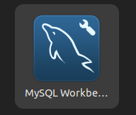

Se abre la aplicación para verificar que inicia correctamente.

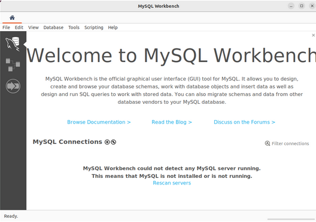

---

## 11. Configuración de conexión en MySQL Workbench

En la pantalla principal de MySQL Workbench se crea una nueva conexión.


Los datos principales de la conexión son:

```text
Connection Name: MySQL Servidor Ubuntu
Hostname: 192.168.1.17
Port: 3306
Username: dhayancliente
```

Después se pulsa en `Test Connection`.

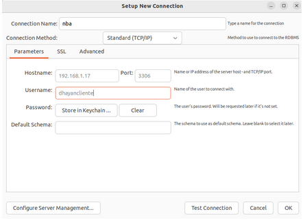

Cuando la herramienta solicita la contraseña, se introduce la contraseña configurada para el usuario remoto.

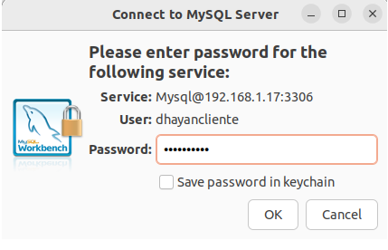

Si la configuración es correcta, MySQL Workbench muestra una confirmación de conexión correcta.

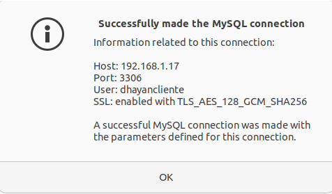

---

## 12. Pruebas desde MySQL Workbench

Una vez creada la conexión, se accede a ella desde la pantalla principal.

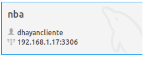

Dentro de la conexión se comprueba que la base de datos está disponible.

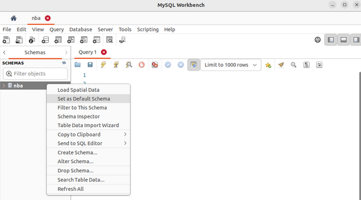

Después se ejecuta una consulta para verificar que las tablas se han cargado correctamente.

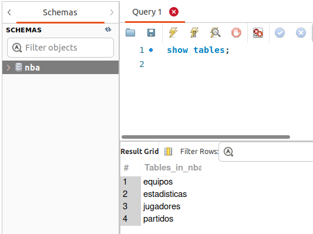

También se comprueba la visualización de datos desde la interfaz gráfica.

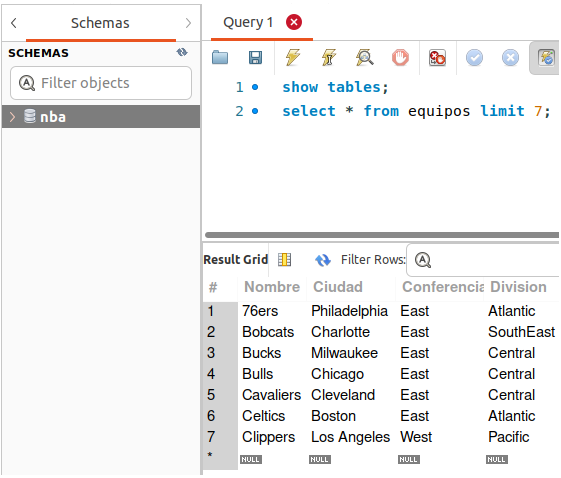

Con estas pruebas se confirma que MySQL Workbench puede conectarse al servidor MySQL y trabajar con la base de datos remota.

---

## 13. Pruebas con DBeaver

Además de MySQL Workbench, también se prueba la conexión con DBeaver desde la máquina cliente.

Se abre DBeaver y se crea una nueva conexión de base de datos.

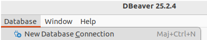

Se selecciona MySQL como tipo de base de datos.

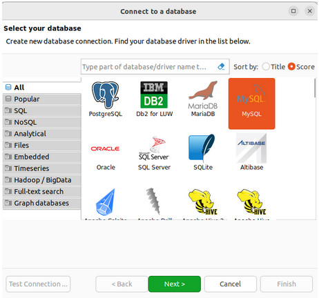

Se rellenan los datos de conexión.

```text
Host: 192.168.1.17
Port: 3306
Database: nba
User: dhayancliente
Password: CHANGE_ME_REMOTE_PASSWORD
```

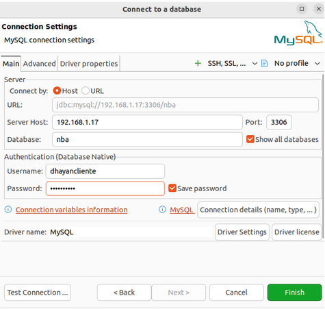

Después se prueba la conexión.

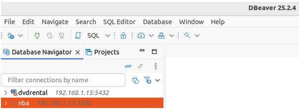

Una vez conectados, se comprueba que se puede acceder a la base de datos.

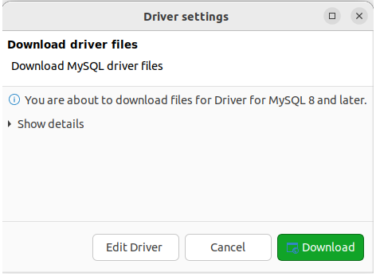

Finalmente se realiza una consulta para verificar el acceso a los datos.

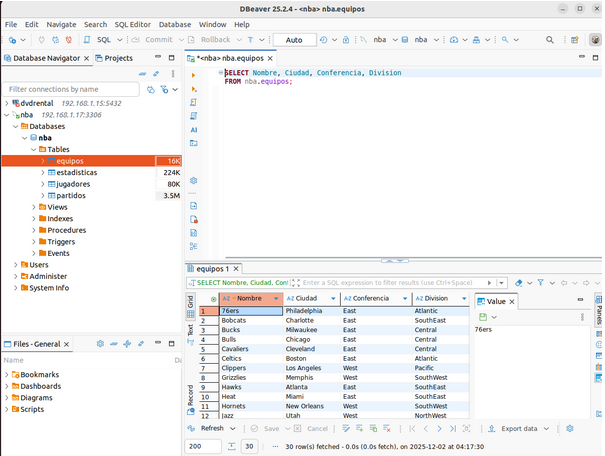

Con esto se confirma que también es posible acceder al servidor MySQL usando una herramienta gráfica alternativa.

---

## 14. Comprobaciones realizadas

Durante la práctica se realizaron varias comprobaciones.

Comprobar el estado del servicio:

```bash
sudo systemctl status mysql
```

Comprobar que MySQL escucha en el puerto 3306:

```bash
sudo ss -tulnp | grep 3306
```

Comprobar acceso local al servidor:

```bash
sudo mysql
```

Comprobar conexión remota desde el cliente:

```bash
mysql -h 192.168.1.17 -u dhayancliente -p
```

Comprobar bases de datos:

```sql
SHOW DATABASES;
```

Comprobar tablas:

```sql
SHOW TABLES;
```

Comprobar usuarios creados:

```sql
SELECT user, host FROM mysql.user;
```

Estas comprobaciones permiten verificar que la instalación, la configuración del servidor, la creación de usuarios y la conexión remota funcionan correctamente.

---

## 15. Problemas habituales revisados

En una práctica de MySQL cliente-servidor, los errores más habituales suelen estar relacionados con la conexión remota.

Los puntos principales a revisar son:

* Servicio MySQL detenido.
* `bind-address` configurado solo en `127.0.0.1`.
* Puerto 3306 no accesible.
* Usuario creado solo para `localhost`.
* Contraseña incorrecta.
* Permisos insuficientes sobre la base de datos.
* Firewall bloqueando conexiones.
* IP del servidor incorrecta en el cliente.
* Cliente y servidor en redes distintas sin conectividad.

En esta práctica, las comprobaciones desde terminal, MySQL Workbench y DBeaver ayudan a verificar cada una de estas partes.

---

## 16. Seguridad aplicada en el repositorio

Para publicar la práctica he sustituido las contraseñas por valores placeholder.

Ejemplos utilizados:

```text
CHANGE_ME_ROOT_PASSWORD
CHANGE_ME_REMOTE_PASSWORD
CHANGE_ME_PASSWORD
```

También se evita publicar datos sensibles innecesarios. En un entorno real, las contraseñas deberían gestionarse fuera del repositorio, por ejemplo mediante variables de entorno o gestores de secretos.

---

## 17. Organización del repositorio

La estructura final del repositorio queda organizada de esta forma:

```text
mysql-cliente-servidor-ubuntu/
|-- README.md
|-- .gitignore
|-- .gitattributes
|-- docs/
|   |-- memoria.md
|-- capturas/
|   |-- .gitkeep
|   |-- primera.png
|   |-- segunda.png
|   |-- tercera.png
|   |-- cuarta.png
|   |-- quinta.png
|   |-- sexta.png
|   |-- septima.png
|   |-- octava.png
|   |-- novena.png
|   |-- decima.png
|   |-- once.png
|   |-- doce.png
|   |-- trece.png
|   |-- catorce.png
|   |-- quince.png
|   |-- dieciseis.png
```

---

## 18. Archivos ignorados

El archivo `.gitignore` evita subir archivos temporales o configuraciones locales.

Contenido principal:

```text
logs/
*.log
*.tmp
*.bak
.DS_Store
.env
.vscode/
```

Esto ayuda a mantener el repositorio limpio y centrado en la documentación y las evidencias necesarias.

---

## 19. Control de saltos de línea

El archivo `.gitattributes` define reglas para mantener saltos de línea compatibles con Linux.

Contenido principal:

```text
*.md text eol=lf
*.sql text eol=lf
*.sh text eol=lf
.gitignore text eol=lf
.gitattributes text eol=lf
```

Esto evita problemas al trabajar desde Windows y publicar documentación o scripts pensados para entornos Linux.

